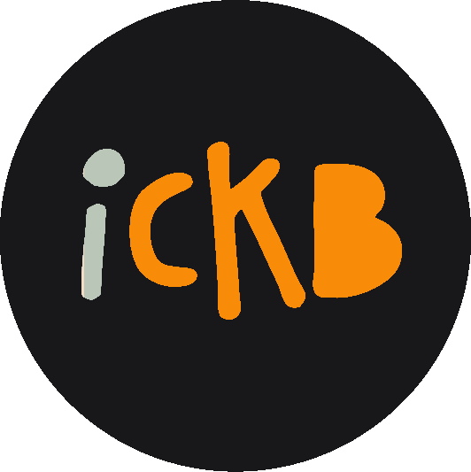

# 

## Listenable Introduction

If you would like to listen to an introduction of the project before diving in, Jordan Mack explains iCKB in less than 7 minutes during an episode of [Hashing it Out](https://www.youtube.com/watch?v=CcFFuenup38&t=781s).

## Testnet DApp

If you would like to try out the DApp to get an idea on how it works, [iCKB DApp is live on testnet](http://ickb.github.io/v1-interface).

## Problem

### NervosDAO Illiquidity

The NervosDAO is possibly the most important smart-contract of Nervos Layer 1 (L1). A CKB holder can lock his CKB in the NervosDAO in exchange for a receipt of that specific deposit. Every 180 epochs (~30 days) the depositor has the option of exchanging his receipt to unlock his initial deposit plus accrued interest. This creates an illiquidity for the depositor while the CKB is locked.

### Untapped Potential

There exists untapped potential in the Nervos ecosystem for a protocol that can liquify NervosDAO accrued interest and bridge it from L1 to L2. This protocol could enable CKB-based [Initial Stake Pool Offerings](https://www.meld.com/ispo) (ISPO), where users can lock CKB to support new early stage projects without losing their original CKB deposit.

The protocol could also be used to enable a community voting mechanism with funds locked in the NervosDAO, as well as a multitude more L1 & L2 applications!

Looking far away, this protocol could also enable Godwoken switch from pCKB to a new native token that protects every Godwoken user from CKB issuance.

### dCKB (Unmaintained)

In the past there has been an effort to tackle this challenge by [NexisDAO with dCKB](https://docs.nexisdao.com/nexisdao/mint-dckb). Their approach is to tokenize the holder receipt, which in turn becomes tradeable and so the holder keeps being liquid. The issue with their approach is that only the original owner can unlock the deposit. Judging by their [GitHub repository's issues](https://github.com/NexisDao/NexisDao-core/issues), dCKB does not appear to be actively maintained.

### wstCKB (Under Development)

Currently there is a new effort to tackle this challenge by Stable++. They are developing a new solution behind closed doors and as such not much information is publicly available on wstCKB, [except for](https://www.reddit.com/r/NervosNetwork/comments/1etnlqv/stable_part_2/):

> Stable++ also introduces Liquidity Staking through Nervos Dao. Users can stake CKB in exchange for wstCKB, allowing them to earn staking rewards while still being able to use their wstCKB for investments without losing liquidity.

At direct question on their public Telegram group, [Alive24 explained](https://t.me/Stablepp/881):

> At the moment, as LST is still under development [...] If anything **disclosable**, we attempt to make wstCKB in a way similar to wstETH in terms of rebasing mechanism and anonymous Nervos DAO cell deposit and withdrawal. Any further details are still under development and adjustment. [...] I've read the proposal today and we found a lot in common! Thanks for the advice and definitely it would be of inspirations.

From the information now available seems wstCKB is staying clear of dCKB mistakes and closely following iCKB steps.

Which brings the question: [Is really worth developing an iCKB look-alike and doubling the effort?](https://github.com/stablepp/media-kit/issues/1)

Let's say, a wstCKB too similar to iCKB is developed, the result would be a split liquidity between iCKB and wstCKB, so smaller Deposit Pool size for both, which would bring the following downsides for everyone:

1. Longer withdrawal wait time as the temporal density of deposits maturity depends on Deposit Pool size.
2. [Busiwork Attack feasibility](https://github.com/ickb/proposal/issues/8).

## Solution

### Enter iCKB

The **inflation-protected CKB** (iCKB) is a Nervos L1 [xUDT token](https://github.com/nervosnetwork/rfcs/blob/master/rfcs/0052-extensible-udt/0052-extensible-udt.md) responsible for protecting users against [Nervos secondary issuance inflation](https://www.nervos.org/knowledge-base/understanding_nervos_ckb_issuance_model#secondary_issuance) like NervosDAO, while at the sime time being a liquid asset. In this proposal, the **inflation-protected CKB** will be referred as iCKB.

As with dCKB, iCKB's approach is to tokenize NervosDAO receipts, but with a twist: the protocol owns all the CKB deposits and maintains a pool of them. This means that all the deposits and withdrawals are shared, so anyone can use anyone else's deposit to exit once it's mature.

This protocol aims to solve two problems with NervosDAO:

- CKB locked in the NervosDAO remains liquid as iCKB can truly be used as a normal currency.
- iCKB can be converted back to CKB quickly at any time without having to wait for maturity.

### Water Mill Analogy

As a [water mill](https://tenor.com/view/water-wheel-mill-gif-19806697) has many distinct buckets, each at different wheel positions, in which the water is:

- Collected
- Maintained
- Released

In the same way, the protocol can have many distinct deposits, each of them constantly moving at different stages of maturity:

- **Collected**: Users deposit CKB and receive iCKB.
- **Maintained**: Deposits accrue interest in the NervosDAO.
- **Released**: If a user wants to exchange iCKB for CKB, they can use any deposit that is at maturity.

### Feedback

Jordan Mack's comments on Nervos L1 & iCKB:
> In a more abstract sense, this doesn't violate any of intentions of the platform. The CKB that is staked is still out of circulation. iCKB does not grant the holder the ability to store data on the blockchain. In the most pure sense, iCKB is enabling the functionality that dCKB was trying to achieve. It better solves the problem because anyone can unlock the original CKB from the NervosDAO using iCKB instead of requiring the original owner to unlock it as with dCKB.

## Team

### Phroi

I'm a developer, going by the pseudonym Phroi. I'd like to spend my time working on projects that give meaning to my life and improve the life of users. Win-win situations. The best way to interact with me is in a written format, English is not my native language. A bit on the over-thinker side, so much that I'm unwillingly finding vulnerabilities in other people work.

### Discovering iCKB

During February 2022, while [testing the ground for a NervosDAO based ISPO](https://discord.com/channels/657799690070523914/657799690552606745/943306112889933864), I discovered the untapped need for a token that liquefies and bridges interests from L1 to L2 and so with Jordan Macks's help I started researching its feasibility. It's since then that I'm working on iCKB.

## Diving Into The Protocol

### On-Chain, Trust-Less and Decentralized

This protocol defines a solid way to exchange between CKB and iCKB. The design aim is to make iCKB as simple, robust and neutral as possible, making it capable of meeting the current and future needs of Nervos users.

This protocol lives completely on Nervos Layer 1. It works by wrapping NervosDAO transactions: a deposit is first tracked by its protocol receipt and later on it's converted in its equivalent amount of iCKB.

### iCKB/CKB Exchange Rate Idea

The iCKB mechanism for wrapping interest is similar to [Compound's cTokens](https://compound.finance/docs/ctokens). The CKB to iCKB exchange rate is determined by block number. At the genesis block `1 CKB` is equal to `1 iCKB`. As time passes `1 CKB` is slowly worth less than `1 iCKB` at a rate that matches the issuance from the NervosDAO. This is because iCKB is gaining value. An easier way to understand this is to think of:

- CKB as inflationary
- iCKB as non-inflationary

Jordan Mack's comment on this method:
> That's a clever approach. Thinking of it as iCKB being the base and CKB being what is moving makes it much easier to understand.

The inflation rate of CKB is well defined by the [NervosDAO compensation rate](https://explorer.nervos.org/charts/nominal-apc) and only depends on:

- [The block concept in L1](https://docs.nervos.org/docs/basics/glossary/#block)
- [The epoch concept in L1](https://docs.nervos.org/docs/basics/glossary/#epoch)
- [The formula itself](https://github.com/nervosnetwork/rfcs/blob/master/rfcs/0023-dao-deposit-withdraw/0023-dao-deposit-withdraw.md#calculation)

Therefore, the iCKB/CKB exchange rate will always be precise as determined by the formula and the current block. The only risk to this deterministic peg would be a smart contract exploit to the deposit pool or minting contract. These kinds of attack vectors are greatly mitigated by external audits.

### Standard Deposit

As in real life bricks can be used to build houses of any size, in the same way seems natural to establish a reasonably small standard deposit size that can be used to construct deposits of any size.

In this way a few goals are achieved:

- Big deposits, split into standard deposits, increase the overall protocol liquidity.
- No size mismatch means anybody can use anybody else deposit to withdraw.
- The following form of DoS is prevented:

Let’s assume there is no requirement on deposit size, so as in NervosDAO users can choose the deposit size they prefer. Then an attacker who can borrow a big enough capital can simply attack by repeating the following two steps:

- Deposit CKB for iCKB in deposits as big as the entirety of his capital.
- Exchange iCKB for smaller CKB deposits.

This would greatly reduce the quality of the service for everyone, as the only remaining deposits would be as big or bigger than the attacker capital and since it’s impossible to withdraw partially from a NervosDAO deposit, this would greatly hamper the protocol fruition.

Back to the standard deposit definition, its size could be defined in CKB terms or in iCKB terms:

- Defining it in CKB terms means that as deposits are made in time, every deposit would have a different size due to the NervosDAO interests, so it's not working as intended.
- Defining it in iCKB terms means that at each block a standard deposit would have the same size both in CKB and iCKB. Of course as time passes, the deposit size would be fixed in iCKB-equivalent terms but gradually increasing in CKB terms.

Let's define the **standard deposit size** as `100000 iCKB`.

### iCKB/CKB Exchange Rate Calculation

Excluding deposit cell occupied capacity, per definition `100000 iCKB` are equal to `100000 CKB` staked in NervosDAO at the genesis block, let's calculate what this means.

From the last formula from [NervosDAO RFC Calculation section](https://github.com/nervosnetwork/rfcs/blob/master/rfcs/0023-dao-deposit-withdraw/0023-dao-deposit-withdraw.md#calculation):
> Nervos DAO compensation can be calculated for any deposited cell. Assuming a Nervos DAO cell is deposited at block `m`, i.e. the `deposit cell` is included at block `m`. One initiates withdrawal and gets phase 1 `withdrawing cell` included at block `n`. The total capacity of the `deposit cell` is `c_t`, the occupied capacity for the `deposit cell` is `c_o`. [...] The maximum withdrawable capacity one can get from this Nervos DAO input cell is:
>
> `( c_t - c_o ) * AR_n / AR_m + c_o`

`AR_n` is defined in the [NervosDAO RFC Calculation section](https://github.com/nervosnetwork/rfcs/blob/master/rfcs/0023-dao-deposit-withdraw/0023-dao-deposit-withdraw.md#calculation):

> CKB's block header has a particular field named `dao` containing auxiliary information for Nervos DAO's use. Specifically [...] `AR_i`: the current `accumulated rate` at block `i`. `AR_j / AR_i` reflects the CKByte amount if one deposit 1 CKB to Nervos DAO at block `i`, and withdraw at block `j`.

Let's fix a few constants:

- `c_o = 82 CKB` (occupied cell capacity of a standard deposit cell)
- `c_t = 100082 CKB` (total cell capacity equals the iCKB-equivalent deposit size plus its occupied capacity)
- `AR_0 = 10 ^ 16` (genesis accumulated rate)

So by depositing `100082` CKB at block `0`, **iCKB/CKB exchange ratio** at block `n` is defined as:

- `100000 iCKB := 100000 CKB * AR_n / 10 ^ 16` (excluding `82 CKB` of occupied cell capacity)

Conversely, by plugging block `m` as deposit block and block `0` as withdrawal block in NervosDAO's formula, it's possible to calculate how many iCKB are worth `100082` CKB deposited at block `m`:

- `100000 CKB * 10 ^ 16 / AR_m` (excluding `82 CKB` of occupied cell capacity)

This shows that the iCKB/CKB exchange rate only depends on a few constants and the accumulated rate, defined in the deposit's block header.

### Deposit

In NervosDAO, a deposit is a single transaction in which a CKB holder locks his CKB in exchange for a NervosDAO receipt of that **specific deposit**.

In the proposed protocol, a deposit is the process in which a CKB holder locks his CKB in exchange for iCKB tokens.

This process can't happen in a single transaction due to a Nervos L1 technical choice: as seen from the [previous section](#ickbckb-exchange-rate-calculation), to mint the iCKB equivalent for a deposit the protocol needs to access the current [`accumulated rate`](https://github.com/nervosnetwork/rfcs/blob/master/rfcs/0023-dao-deposit-withdraw/0023-dao-deposit-withdraw.md#calculation), which is defined in the deposit's block header, then again Nervos L1 is [off-chain deterministic](https://justjjy.com/Offchain-determinism), so [the current block header cannot be accessed while validating a transaction](https://github.com/nervosnetwork/ckb/blob/f93b498379173353b5804818b33227cc302ffd6a/script/src/syscalls/load_header.rs#L72).

Thus the protocol is forced to split a deposit in two phases:

1. In the first phase, the CKB holder locks his CKB in exchange for a protocol receipt of the **specific amount deposited**.
2. In the second phase, the deposit's header block is available, so the protocol receipt can be transformed into iCKB tokens.

### Deposit Phase 1

In this first phase the protocol:

- Transforms input CKB into NervosDAO deposit cells locked by iCKB Logic Script, in short a deposit.
- Awards to the user a protocol receipt of the deposits, effectively wrapping them.

Given the impossibility to access the header in this phase, it cannot exist a strict requirement on deposits iCKB-equivalent size. On the other hand, to achieve higher deposits fungibility and to prevent a certain form of DoS, the protocol needs to incentivize [standard deposits](#standard-deposit).

In particular, deposits bigger than the standard deposit size are actively disincentivized: the user will receive only 90% of the iCKB amount exceeding a standard deposit. The remaining 10% is offered as a discount to whoever is willing to withdraw from the oversized deposits. Additionally, the maximum unoccupied capacity per single deposit is fixed at `1M CKB`. This upper bound prevents [a certain form of DoS](#standard-deposit), while still leaving enough slack for the standard deposit CKB size to grow for well over a hundred of years.

On the other side, deposits smaller than the standard deposit size are intrinsically disincentivized by L1 dynamics. As deposits gets smaller they incur a bigger penalty in form of unaccounted occupied capacity. Additionally, the minimum unoccupied capacity per single deposit is fixed at `1000 CKB`. This lower bound prevents users from making deposits too detrimental to themselves.

Taking in consideration these incentives, at least 90% of the deposit amount is always converted. Of course the optimal strategy for a depositor is to split his CKB into standard deposits.

Since having a separate receipt per deposit cell would be capital inefficient, the protocol allows to account multiple deposit with a single receipt. An iCKB receipt accounts for a group of deposits with the same size, it just contains the single deposit unoccupied CKB capacity and the quantity of the accounted deposits. In a transaction output there can be many receipt cells and possibly more than one receipt for the same deposit size.

For simplicity [a transaction containing NervosDAO script is currently limited to `64` output cells](https://github.com/nervosnetwork/ckb-system-scripts/blob/814eb82c44f560dbdad2be97eb85464062920237/c/dao.c#L38-L41) so that processing is simplified. This limitation may be relaxed later on in a future NervosDAO script update.

In a receipt cell data:

- The second `8 bytes` store the deposit unoccupied capacity, which is the single deposit capacity minus its occupied capacity, the actual `deposit_amount`. A single receipt tracks a group of deposits with same unoccupied capacity in the current tx output. Multiple receipts for a specific unoccupied capacity may be created where each one keep track of a different group of deposits.
- The first `4 bytes` store the quantity of deposits with same unoccupied capacity being tracked in the tx output. A tx may create many deposits with the same unoccupied capacity. This counter keeps track of how many deposits with the same unoccupied capacity are being tracking in the current tx by this specific receipt.

Summing up, in the first deposit phase, these rules must be followed:

- A **deposit** is defined as Nervos DAO deposit with an iCKB Logic Lock `{CodeHash: iCKB Logic Hash, HashType: Data1, Args: Empty}`.
- A single deposit unoccupied capacity cannot be lower than `1000 CKB` nor higher than `1M CKB`.
- A group of same size deposits must be accounted by a receipt.
- A **receipt** is defined as a cell with iCKB Logic Type `{CodeHash: iCKB Logic Hash, HashType: Data1, Args: Empty}`, the first 16 bytes of cell data are reserved for:
  - `deposit_quantity` keeps track of the quantity of deposits (4 bytes)
  - `deposit_amount` keeps track of the single deposit unoccupied capacity (8 bytes)
- No more than 64 output cells are allowed, due to the current NervosDAO restriction.
- CellDeps must contain iCKB Dep Group comprising of: iCKB Logic Script and Nervos DAO Script.

**Receipt data molecule encoding:**

```molecule
array Uint32           [byte; 4];
array Uint64           [byte; 8];

struct ReceiptData {
    deposit_quantity:  Uint32,
    deposit_amount:    Uint64,
}
```

**Example of deposit phase 1:**

```yaml
CellDeps:
    - iCKB Dep Group cell
    - ...
Inputs:
    - ...
Outputs:
    - Nervos DAO deposit cell with iCKB Logic Lock:
        Data: 8 bytes filled with zeros
        Type: Nervos DAO
        Lock:
            CodeHash: iCKB Logic Hash
            HashType: Data1
            Args: Empty
    - ...
    - Receipt:
        Data: ReceiptData
            deposit_quantity: Quantity of deposits (4 bytes)
            deposit_amount: Single deposit unoccupied capacity (8 bytes)
        Type:
            CodeHash: iCKB Logic Hash
            HashType: Data1
            Args: Empty
        Lock: A lock that identifies the user
```

### Deposit Phase 2

A receipt accrues interests and it can be used to withdraw, but it's not liquid nor transferrable.

The second phase of the deposit transforms a receipt into its equivalent amount of iCKB tokens, which in turn is both liquid and transferrable. This conversion is now possible thanks to the header of the deposit block now available.

As seen in [iCKB/CKB Exchange Rate Calculation](#ickbckb-exchange-rate-calculation) for each receipt the equivalent amount of iCKB is well defined. The only difference being the incentivization: oversized receipts are subject to a 10% fee on the amount exceeding a standard deposit.

In the second deposit phase, these rules must be followed:

- The iCKB value of a receipt is calculated as

```pseudocode
iCKB_value(unoccupied_capacity, AR_m) {
    let s = unoccupied_capacity * AR_0 / AR_m;
    if s > standard_deposit_size {
        s = s - (s - standard_deposit_size) / 10
    }
    return s;
}

receipt_iCKB_value(deposit_quantity, deposit_amount, AR_m) {
    return deposit_quantity * iCKB_value(deposit_amount, AR_m);
}
```

- The total iCKB value of input tokens and input receipts must be equal to the total iCKB value of output tokens.
- iCKB xUDT flags are set to `0x80000000` to enable [xUDT owner mode by input type](https://github.com/nervosnetwork/rfcs/blob/master/rfcs/0052-extensible-udt/0052-extensible-udt.md#owner-mode-update). This flag must later on be encoded as a `Uint32` Little Endian, so it's final encoding is `0x00000080`.
- HeaderDeps must include the hash of the header of the on-chain block containing the receipt tx for each receipt being converted into iCKB xUDT.
- CellDeps must contain iCKB Dep Group comprising of: iCKB Logic Script, Standard xUDT Script and Nervos DAO Script.

**Example of deposit phase 2:**

```yaml
CellDeps:
    - iCKB Dep Group cell
    - ...
HeaderDeps: 
    - Receipt Block Header Hash
    - ...
Inputs:
    - Receipt:
        Data: ReceiptData
        Type:
            CodeHash: iCKB Logic Hash
            HashType: Data1
            Args: Empty
        Lock: A lock that identifies the user
    - ...
Outputs:
    - Token:
        Data: amount (16 bytes)
        Type:
            CodeHash: Standard xUDT Script
            HashType: Data1
            Args: [iCKB Logic Script Hash, 0x80000000]
        Lock: A lock that identifies the user
```

### Withdrawal

In NervosDAO time is slotted in batches of 180 epochs depending on the initial deposit timing, a withdrawal is split in two steps:

1. In the first transaction the user requests the withdrawal.
2. In the second transaction the user withdraws the deposit plus interests. Must be after the end of the 180 epoch batch in which the first transaction happened.

As seen in [NervosDAO RFC Calculation section](https://github.com/nervosnetwork/rfcs/blob/master/rfcs/0023-dao-deposit-withdraw/0023-dao-deposit-withdraw.md#calculation) the actual withdrawn CKB amount depends on the deposit block and on the withdrawal request block.

The proposed protocol instead proceed by un-wrapping iCKB tokens into NervosDAO withdrawal cells:

1. In the first transaction the user:
    - Requests the withdrawal from some protocol controlled deposits.
    - Respectfully to that quantity, burns a bigger or equal amount of iCKB tokens and/or receipts.
2. The second transaction is a Nervos DAO second withdrawal step.

As seen in [iCKB/CKB Exchange Rate Calculation](#ickbckb-exchange-rate-calculation) for each deposit and receipt the equivalent amount of iCKB is well defined. The only difference being the incentivization: requesting the withdrawal from an oversized deposit is incentivized by a 10% discount on the amount exceeding a standard deposit.

An additional NervosDAO constraint is that if deposit lock and withdrawal request lock differs, as in iCKB case, then NervosDAO requires the deposit lock and withdrawal request lock to have the same size. A non solution would be to use a lock with zero padded args in the deposit, then again different user locks would have different sizes, so it wouldn't solve the problem at hand. While iCKB Logic script is independent to the withdrawal request lock choice, this lock has some pretty restrictive constraints, as no information can be stored in its lock args nor in its cell data. For this reason has been developed [Owned Owner Script](#owned-owner-script).

Summing up, when withdrawing, these rules must be followed:

- The iCKB value of receipts and deposits is calculated as

```pseudocode
iCKB_value(unoccupied_capacity, AR_m) {
    let s = unoccupied_capacity * AR_0 / AR_m;
    if s > standard_deposit_size {
        s = s - (s - standard_deposit_size) / 10
    }
    return s;
}

receipt_iCKB_value(deposit_quantity, deposit_amount, AR_m) {
    return deposit_quantity * iCKB_value(deposit_amount, AR_m);
}

deposit_iCKB_value(capacity, occupied_capacity, AR_m) {
    return iCKB_value(capacity - occupied_capacity, AR_m);
}
```

- The total iCKB value of input tokens and input receipts must be bigger or equal to the total iCKB value of output tokens and input deposits, the deposits being withdrawn.
- Withdrawal Request lock must have zero args length and no information stored in the data cell.
- No more than 64 output cells are allowed, due to the current NervosDAO restriction.
- HeaderDeps must include the hash of the header of the on-chain block containing the deposits for each deposit being used to withdraw and each receipt being directly cashed out.
- CellDeps must contain iCKB Dep Group comprising of: iCKB Logic Script, Standard xUDT Script and Nervos DAO Script.

**Example of withdrawal phase 1:**

```yaml
CellDeps:
    - iCKB Dep Group cell
    - ...
HeaderDeps: 
    - Deposit Block Header Hash
    - ...
Inputs:
    - Nervos DAO deposit cell with iCKB Logic Script:
        Data: 8 bytes filled with zeros
        Type: Nervos DAO
        Lock:
            CodeHash: iCKB Logic Hash
            HashType: Data1
            Args: Empty
    - Token:
        Data: amount (16 bytes)
        Type:
            CodeHash: Standard xUDT Script
            HashType: Data1
            Args: [iCKB Logic Script Hash, 0x80000000]
        Lock: A lock that identifies the user
    - ...
Outputs:
    - Nervos DAO phase 1 withdrawal cell:
        Data: Deposit cell's including block number
        Type: Nervos DAO
        Lock: A lock that identifies the user
    - ...
```

### Multiple iCKB Actions in a TX

It's possible to include multiple actions from different phases in one transaction.

One transaction can mix and include many actions from different iCKB phases. For example, a single transaction can consist of all the following actions:

1. Create some new iCKB Deposits and their Receipt.
2. Transform another Receipt into the xUDT iCKB token.
3. Using the xUDT iCKB token to withdraw from some iCKB Deposits.

## Ancillary Scripts

The iCKB protocol without additional scripts would be difficult to use, this section describes the L1 scripts that have been developed to address iCKB user needs.

These scripts offers solutions to specific lock needs, while supporting all users locks. The natural choice to prove user ownership would be to use the delegated signature validation pattern, then again given the incumbent OTX era this pattern has some specific OTX pitfalls. Let's assume that:

- The user lock is OTX signature based.
- The user unlocks some cells with signature in an OTX transaction, first OTX.

An attacker could do the following:

- Attacker includes all other cells locked with delegated user signature in a second OTX.
- Attacker packs this second OTX together with the first OTX in the same transaction.
- These second cells will unlock thanks to delegated signature validation.
- Attacker gains control of this second group of cells.

This is the reason why these scripts are instead designed around a similar but safer pattern:

- A single transaction mint both a controlled cell and controller cell.
- In a transaction there may be multiple controlled cell and controller cell.
- At minting time one of the cells reference the other one using the signed relative index distance between each other.
- The controlled cell satisfies specific user needs.
- The controlled cell uses the new script as lock
- The controlled cell may have an updating method using the new script logic.
- The controller cell has ownership of the controlled cell.
- The controller cell uses the new script as type.
- The controller cell has a lock that identifies the user.
- Melting both cells in the same transaction is the only way to consume both cells.

### Owned Owner Script

While iCKB Logic script is independent to the withdrawal request lock choice, this lock has some pretty restrictive constraints, as no information can be stored in its lock args nor in its cell data. For this reason has been developed Owned Owner Script. This script can only be used in conjunction with withdrawal requests. In a transaction there may be multiple owned cells and owner cells. This script lifecycle consists of two transactions: Mint and Melt.

**Owner data molecule encoding:**

```molecule
array Int32            [byte; 4];

struct OwnedOwnerData {
    owned_distance:    Int32,
}
```

#### Mint Owned Owner

In the Mint transaction, the output contains:

1. The owned cell with this script as lock.
2. The owner cell with this script as type and a lock that identifies the user. This cell memorizes in data the signed relative index distance between the owned cell and itself as a signed 32 bit integer encoded in little-endian.

Validation rule: `owned_index == owner_index + owned_distance`

**Example of withdrawal phase 1 using Owned Owner:**

```yaml
CellDeps:
    - iCKB Dep Group cell
    - Owned Owner data cell
    - ...
HeaderDeps: 
    - Deposit Block Header Hash
    - ...
Inputs:
    - Nervos DAO deposit cell with iCKB Logic Script:
        Data: 8 bytes filled with zeros
        Type: Nervos DAO
        Lock:
            CodeHash: iCKB Logic Hash
            HashType: Data1
            Args: Empty
    - Token:
        Data: amount (16 bytes)
        Type:
            CodeHash: Standard xUDT Script
            HashType: Data1
            Args: [iCKB Logic Script Hash, 0x80000000]
        Lock: A lock that identifies the user
    - ...
Outputs:
    - Nervos DAO phase 1 withdrawal cell:
        Data: Deposit cell's including block number
        Type: Nervos DAO
        Lock: Owned role
            CodeHash: Owned Owner Hash
            HashType: Data1
            Args: Empty
    - Owner cell:
        Data: Signed distance from Owned cell (4 bytes)
        Type: Owner role
            CodeHash: Owned Owner Hash
            HashType: Data1
            Args: Empty
        Lock: A lock that identifies the user
    - ...
```

#### Melt Owned Owner

In the Melt transaction, the input contains both the owned cell and the owner cell. If one of the two is missing the script does't validate.

**Example of withdrawal phase 2 using Owned Owner:**

```yaml
CellDeps:
    - iCKB Dep Group cell
    - Owned Owner data cell
    - ...
HeaderDeps: 
    - Deposit Block Header Hash
    - ...
Inputs:
    - Nervos DAO phase 1 withdrawal cell:
        Data: Deposit cell's including block number
        Type: Nervos DAO
        Lock: Owned role
            CodeHash: Owned Owner Hash
            HashType: Data1
            Args: Empty
    - Owner cell:
        Data: Signed distance from Owned cell (4 bytes)
        Type: Owner role
            CodeHash: Owned Owner Hash
            HashType: Data1
            Args: Empty
        Lock: A lock that identifies the user
    - ...
Outputs:
    - ...
```

### Limit Order Script

Interacting directly with the iCKB protocol has some limitations:

- In transactions containing NervosDAO script, no more than 64 output cells are allowed.
- iCKB Logic discourages deposits bigger or smaller than the standard deposit size.
- There may be a mismatch between the amount the user wants to withdraw and the deposits available in the iCKB pool.
- NervosDAO doesn't allow to partially withdraw from a deposit.
- There is no easy way to merge multiple user intentions within a single deposit or withdrawal.

To abstract over NervosDAO and iCKB protocol limitations, it has been created a lock that implements limit order logic, abstracting user intentions, and that anyone can match partially or completely, similarly to an ACP lock. This lock aims to be compatible with all types that follows the sUDT convention of storing the amount in the first 16 bytes of cell data and store no data in the witness, at the moment sUDT and partially xUDT. If a UDT needs to store data on Witness, then it should not be used in conjunction with the limit order script. In a transaction there may be multiple orders cells. This script lifecycle consists of three kind of transactions: Mint, Match and Melt.

**Limit Order data molecule encoding:**

```molecule
array Uint8            [byte; 1];
array Uint32           [byte; 4];
array Uint64           [byte; 8];

array Int32            [byte; 4];
array Byte32           [byte; 32];

struct OutPoint {
    tx_hash:           Byte32,
    index:             Uint32,
}

struct Ratio {
    ckb_multiplier:    Uint64,
    udt_multiplier:    Uint64,
}

struct OrderInfo {
    ckb_to_udt:        Ratio,
    udt_to_ckb:        Ratio,
    ckb_min_match_log: Uint8,
}

struct MintOrderData {
    padding:           Byte32,
    master_distance:   Int32,
    order_info:        OrderInfo,
}

struct MatchOrderData {
    master_outpoint:   OutPoint,
    order_info:        OrderInfo,
}

union OrderData {
    MintOrderData,
    MatchOrderData,
}
```

#### Mint Limit Order

In Mint transactions, the output contains:

1. The limit order cell itself with an UDT as type and this script as lock. In the cell data field, this lock memorizes following information:
    - `padding` is used to achieve the same `OrderData` length for both variants.
    - `master_distance` expresses the signed relative index distance between this cell and the master cell.
    - `ckb_to_udt` expresses the order exchange ratio from CKB to UDT.
    - `udt_to_ckb` expresses the order exchange ratio from UDT to CKB
    - `ckb_min_match_log` expresses the logarithm in base 2 of the minimum partial match of the exchanged asset. The UDT minimum match is calculated using the `udt_to_ckb` ratio.

2. The master cell with this script as type and a lock that identifies the user. This cell controls the limit order cell.

Validation rules:

- Only the `MintOrderData` variant of `OrderData` is allowed for a newly minted order.
- Minted order output `index` plus `MintOrderData.master_distance` must be equal to its master cell output `index`.
- `ckb_min_match_log` only valid values are from 0 to 64, extremes included.
- Additional cell data is not allowed in order cells.

**Example of Limit Order mint:**

```yaml
CellDeps:
    - Limit Order data cell
    - ...
Inputs:
    - ...
Outputs:
    - Limit Order cell:
        Data:
            - Amount (16 bytes),
            - MintOrderData variant of OrderData
        Type: xUDT
        Lock: Limit Order role
            CodeHash: Limit Order Hash
            HashType: Data1
            Args: Empty
    - Master cell:
        Data: ...
        Type: Master role
            CodeHash: Limit Order Hash
            HashType: Data1
            Args: Empty
        Lock: A lock that identifies the user
```

#### Match Limit Order

In Match transactions the allowed input limit `OrderData` variants are `MintOrderData` and `MatchOrderData`. While the only allowed output variant is `MatchOrderData`.

The only difference between `MintOrderData` and `MatchOrderData` is that `padding` and `master_distance` are discarded in favour of `master_outpoint`, which keeps track of original master outpoint of the matched order.

Validation rules:

- `in_ckb * ckb_multiplier + in_udt * udt_multiplier <= out_ckb * ckb_multiplier + out_udt * udt_multiplier`
- `in_wanted_asset + 2^log_min_match <= out_wanted_asset`
- An order already completely fulfilled cannot be matched.
- Only `MatchOrderData` variant of `OrderData` is allowed as the matched order in output.
- Implicit Master outpoint must be equal between input and its matched output order:
    1. If input `OrderData` is the variant `MintOrderData`, then input order `outpoint.tx_hash` must be equal to its matched output order `master_outpoint.tx_hash`. Additionally, input order `outpoint.index + master_distance` must be equal to its matched output order `master_outpoint.index`.
    2. If input `OrderData` is the variant `MatchOrderData`, then `master_outpoint` must be equal between input and its matched output order.
- `ckb_to_udt`, `udt_to_ckb` and `ckb_min_match_log` must be equal between input and its matched output order.
- Additional cell data is not allowed in order cells.

**Example of Limit Order Match:**

```yaml
CellDeps:
    - Limit Order data cell
    - ...
Inputs:
    - Limit Order cell:
        Data:
            - Amount (16 bytes),
            - MintOrderData variant of OrderData
        Type: xUDT
        Lock: Limit Order role
            CodeHash: Limit Order Hash
            HashType: Data1
            Args: Empty
Outputs:
    - Limit Order cell:
        Data:
            - Amount (16 bytes),
            - MatchOrderData variant of OrderData
        Type: xUDT
        Lock: Limit Order role
            CodeHash: Limit Order Hash
            HashType: Data1
            Args: Empty
```

#### Melt Limit Order

In the Melt transaction, the input contains both the order cell and its master cell. If one of the two is missing the script does't validate. Any limit `OrderData` variant is allowed as input.

Validation rules:

- Implicit Master outpoint must be equal between input order cell and its input master cell:
    1. If order's `OrderData` is the variant `MintOrderData`, then order `outpoint.tx_hash` must be equal to its input master `outpoint.tx_hash`. Additionally, order `outpoint.index + master_distance` must be equal to its master `outpoint.index`.
    2. If order's `OrderData` is the variant `MatchOrderData`, then order `master_outpoint` must be equal to its master `outpoint`.

**Example of Limit Order melt:**

```yaml
CellDeps:
    - Limit Order data cell
    - ...
Inputs:
    - Limit Order cell:
        Data:
            - Amount (16 bytes),
            - MatchOrderData variant of OrderData
        Type: xUDT
        Lock: Limit Order role
            CodeHash: Limit Order Hash
            HashType: Data1
            Args: Empty
    - Master cell:
        Data: ...
        Type: Master role
            CodeHash: Limit Order Hash
            HashType: Data1
            Args: Empty
        Lock: A lock that identifies the user
Outputs:
    - ...
```

### Multiple Limit Order Actions in a TX

It's possible to include multiple actions from different phases in one transaction.

One transaction can mix and include many actions from different Limit Order phases. For example, a single transaction can consist of all the following actions:

1. Mint many new Limit Orders.
2. Match many existing Limit Orders.
3. Melt many old Limit Orders.

## Audit

This proposal and the [code of iCKB Scripts](https://github.com/ickb/v1-core/tree/master/scripts) has been both internally reviewed by individuals with deep experience in Nervos L1 and [externally audited by the Scalebit team](http://scalebit.xyz/reports/20240911-ICKB-Final-Audit-Report.pdf), an internationally recognized blockchain security team.

## Unsigned Lock Witnesses Malleability

All the script presented in this proposal (iCKB Script, Owned Owner Script and Limit Order Script) follow a novel pattern of using a script both as lock in one cell and type into another cell. While the pattern allows great flexibility, it also comes with an implicit weakness: the cell that uses the script as lock doesn't rely on signature-based verification, so the witnesses in the same group (lock, input type and output type) can be modified by an attacker after user signature. [Credits to @XuJiandong for the discovery](https://github.com/ickb/v1-core/issues/10).

**Rule of thumb**: if a script in a transaction needs to store data in the witness and this data can be tampered without the transaction becoming invalid, then this transaction must not employ the scripts presented in the current proposal.

This witnesses malleability doesn't affect the current iCKB use-cases as no data that can be freely tampered is ever stored into witnesses.

## Confusion Attack on Limit Order

Due to the architectural design of Nervos L1, output locks are not executed during the transaction validation process. Consequently, an attacker may create a limit order that shares the same master cell as an already existing limit order. This situation may lead to confusion to the front-end code regarding the identification of the correct limit order. Users must exercise particular caution when melting their limit order and master cell, as selecting the incorrect limit order could result in the permanent locking of the funds associated with their original limit order. More details in the [dedicated GitHub issue](https://github.com/ickb/proposal/issues/19).

The most practical solution is to fetch the original Mint tx of the Limit Order (LO). With the Mint tx, it's possible to validate (on the front-end) that all the LO parameters are the same between the current LO and the initial Mint LO, but in case there are still multiple LO for the same Master Cell, there must be an additional heuristic.

### Directional LO Heuristic

Directional LO do not increase in value, usually they are constant in value thru their life-cycle. They only increase in value when whoever matches them make mistakes. Normally once a certain progress it's reached (eg LO has been 50% matched), it is not reversible.

**Qualifications for Directional LO**:

- LO has same parameters as Mint LO
- LO has at least the same value as Mint LO

**Heuristic**: say there are multiple LO with same Master cell, the LO with the **best progress** is chosen.

**Counter intuitive property**: LO 100% matched (with value equal to Mint) is preferred over 0% LO matched (with possibly bigger value, but very likely forged by an attacker)

### Dual-Sided LO Heuristic

Dual-Sided LO (those with two ratios) can increase in value. They increase in value when whoever matches them go back and forth between the two assets. So there is no concept of progress here. Any distribution of assets in the LO is not final and can be altered at any time.

**Qualifications for Dual-Sided LO**:

- LO has same parameters as Mint LO
- LO has at least the same value as Mint LO

**Heuristic**: say there are multiple LO with same Master cell, the LO with the **best value** is chosen.

### Implementation

An implementation of this patch can be found in [iCKB/V1-Core](https://github.com/ickb/v1-core/commit/1d90b1fb37d5a2a359372300c9e4c9a9b29b4459).

## Non-Upgradable Deployment

From the start iCKB has been built in the open as a public good. As such iCKB scripts have been deployed in a non-upgradable way. The reason is the following: let's assume iCKB was deployed by type, then whoever controls the lock is hypothetically able to update the binary and steal all the funds. This is not acceptable for a public good such iCKB.

Since no entity owns the deployed scripts, the scripts are deployed with a `secp256k1_blake160` zero lock, an unlockable lock.

Additionally, it has been created the following dependency group:

- iCKB Logic
- Limit Order
- Owned-Owner
- xUDT
- Secp256k1 Blake160
- NervosDAO
- Secp256k1 Data
- Secp256k1 Blake160 Multisig

### [Mainnet Deployment](https://explorer.nervos.org/transaction/0xd7309191381f5a8a2904b8a79958a9be2752dbba6871fa193dab6aeb29dc8f44)

#### [iCKB Logic Mainnet Deployment](https://explorer.nervos.org/script/0x2a8100ab5990fa055ab1b50891702e1e895c7bd1df6322cd725c1a6115873bd3/data1)

| parameter | value |
| --- | --- |
| code_hash | 0x2a8100ab5990fa055ab1b50891702e1e895c7bd1df6322cd725c1a6115873bd3 |
| hash_type | data1 |
| tx_hash | 0x621a6f38de3b9f453016780edac3b26bfcbfa3e2ecb47c2da275471a5d3ed165 |
| index | 0x0 |
| dep_type | depGroup |

#### [Limit Order Mainnet Deployment](https://explorer.nervos.org/script/0x49dfb6afee5cc8ac4225aeea8cb8928b150caf3cd92fea33750683c74b13254a/data1)

| parameter | value |
| --- | --- |
| code_hash | 0x49dfb6afee5cc8ac4225aeea8cb8928b150caf3cd92fea33750683c74b13254a |
| hash_type | data1 |
| tx_hash | 0x621a6f38de3b9f453016780edac3b26bfcbfa3e2ecb47c2da275471a5d3ed165 |
| index | 0x0 |
| dep_type | depGroup |

#### [Owned-Owner Mainnet Deployment](https://explorer.nervos.org/script/0xacc79e07d107831feef4c70c9e683dac5644d5993b9cb106dca6e74baa381bd0/data1)

| parameter | value |
| --- | --- |
| code_hash | 0xacc79e07d107831feef4c70c9e683dac5644d5993b9cb106dca6e74baa381bd0 |
| hash_type | data1 |
| tx_hash | 0x621a6f38de3b9f453016780edac3b26bfcbfa3e2ecb47c2da275471a5d3ed165 |
| index | 0x0 |
| dep_type | depGroup |

#### iCKB xUDT Mainnet

| parameter | value |
| --- | --- |
| name | iCKB |
| symbol | iCKB |
| decimals | 8 |
| metadata_tx_hash | 0x490cd47d7491b8dcb74f22bd7607b176bf7dbe13d4cc9c2d0f50dc7208082f6d |
| script_hash | 0xd485c2271949c232e3f5d46128336c716f90bcbf3cb278696083689fbbcd407a |
| code_hash | 0x50bd8d6680b8b9cf98b73f3c08faf8b2a21914311954118ad6609be6e78a1b95 |
| hash_type | data1 |
| args | 0xb73b6ab39d79390c6de90a09c96b290c331baf1798ed6f97aed02590929734e800000080 |
| tx_hash | 0x621a6f38de3b9f453016780edac3b26bfcbfa3e2ecb47c2da275471a5d3ed165 |
| index | 0x0 |
| dep_type | depGroup |

### [Testnet Deployment](https://pudge.explorer.nervos.org/transaction/0x9ac989b3355764f76cdce02c69dedb819fdfbcbda49a7db1a2c9facdfdb9a7fe)

#### [iCKB Logic Testnet Deployment](https://pudge.explorer.nervos.org/script/0x2a8100ab5990fa055ab1b50891702e1e895c7bd1df6322cd725c1a6115873bd3/data1)

| parameter | value |
| --- | --- |
| code_hash | 0x2a8100ab5990fa055ab1b50891702e1e895c7bd1df6322cd725c1a6115873bd3 |
| hash_type | data1 |
| tx_hash | 0xf7ece4fb33d8378344cab11fcd6a4c6f382fd4207ac921cf5821f30712dcd311 |
| index | 0x0 |
| dep_type | depGroup |

#### [Limit Order Testnet Deployment](https://pudge.explorer.nervos.org/script/0x49dfb6afee5cc8ac4225aeea8cb8928b150caf3cd92fea33750683c74b13254a/data1)

| parameter | value |
| --- | --- |
| code_hash | 0x49dfb6afee5cc8ac4225aeea8cb8928b150caf3cd92fea33750683c74b13254a |
| hash_type | data1 |
| tx_hash | 0xf7ece4fb33d8378344cab11fcd6a4c6f382fd4207ac921cf5821f30712dcd311 |
| index | 0x0 |
| dep_type | depGroup |

#### [Owned-Owner Testnet Deployment](https://pudge.explorer.nervos.org/script/0xacc79e07d107831feef4c70c9e683dac5644d5993b9cb106dca6e74baa381bd0/data1)

| parameter | value |
| --- | --- |
| code_hash | 0xacc79e07d107831feef4c70c9e683dac5644d5993b9cb106dca6e74baa381bd0 |
| hash_type | data1 |
| tx_hash | 0xf7ece4fb33d8378344cab11fcd6a4c6f382fd4207ac921cf5821f30712dcd311 |
| index | 0x0 |
| dep_type | depGroup |

#### iCKB xUDT Testnet

| parameter | value |
| --- | --- |
| name | iCKB |
| symbol | iCKB |
| decimals | 8 |
| metadata_tx_hash | 0x8b33577d05662003f206fb2886c32810866dca51821f0db31e3a05b06a7e3bf9 |
| script_hash | 0xd485c2271949c232e3f5d46128336c716f90bcbf3cb278696083689fbbcd407a |
| code_hash | 0x50bd8d6680b8b9cf98b73f3c08faf8b2a21914311954118ad6609be6e78a1b95 |
| hash_type | data1 |
| args | 0xb73b6ab39d79390c6de90a09c96b290c331baf1798ed6f97aed02590929734e800000080 |
| tx_hash | 0xf7ece4fb33d8378344cab11fcd6a4c6f382fd4207ac921cf5821f30712dcd311 |
| index | 0x0 |
| dep_type | depGroup |

## Future

At the inception of iCKB, the following were the intended possible use cases:

- CKB-based Initial Stake Pool Offerings.
- The official Nervos DAO community voting mechanism.
- Godwoken switch from pCKB to iCKB, protecting users from CKB issuance.
- A multitude more L1 & L2 applications!

A few things changed since the inception, these are the updated use cases:

- ISPO is a well thought model, but currently Nervos has already a Community Fund. So the need has already been addressed. Developing an ISPO now may provide different paths & rules for accessing funding.
- Switching from pCKB to iCKB would give free interests to any CKB holder on Godwoken, then again feels like Godwoken never really found its use case.
- In the short term the most impactful iCKB result will be that more users will feel comfortable in stacking into NervosDAO by using iCKB. So more and more CKB will be locked into NervosDAO, which is an achievement in itself.
- In the medium term more and more decentralized finance protocols will integrate iCKB. So users will be able to enjoy the interests payed out by both these protocols and NervosDAO.
- In the long term more and more UTXO chains will be integrated with Nervos thanks to [RGB++, iCKB is in the ideal position of taking advantage of this](https://github.com/ckb-cell/RGBPlusPlus-design/blob/main/docs/light-paper-en.md#coins). Users from other chains will be able to enjoy the interests payed out by NervosDAO, while being liquid. Also other chains protocols will be able to build on top of iCKB. So users will be able to enjoy the interests payed out by both these other chains protocols and NervosDAO.

## Useful Resources

- [iCKB DApp](https://ickb.org)
- [Hashing it Out introduction to iCKB](https://www.youtube.com/watch?v=CcFFuenup38&t=781s)
- [iCKB Thread on Telegram](https://t.me/NervosNation/307406)
- [\[AMA\] Everything iCKB on Nervos Talk](https://talk.nervos.org/t/ama-everything-ickb/7871)
- [Thread for iCKB development on Discord](https://discord.com/channels/657799690070523914/980237827122032730)
- [iCKB AMA on Reddit](https://old.reddit.com/r/NervosNetwork/comments/1erw6v8/ickb_ama/)
- [iCKB journey into CoBuild on Nervos Talk](https://talk.nervos.org/t/ickb-journey-into-cobuild/7918)
- [iCKB Scripts code](https://github.com/ickb/v1-core/tree/master/scripts)
- [Scalebit Audit](https://scalebit.xyz/reports/20240911-ICKB-Final-Audit-Report.pdf)
- [Initial proposal on Nervos Talk](https://talk.nervos.org/t/looking-for-feedback-ickb-a-tokenization-of-nervosdao-deposits/6772)
- [Is wstCKB just another iCKB?](https://github.com/stablepp/media-kit/issues/1)
- [Reference proposal](https://github.com/ickb/proposal)

## License

This proposal is distributed under [MIT License](https://github.com/ickb/proposal/blob/master/LICENSE.txt).
